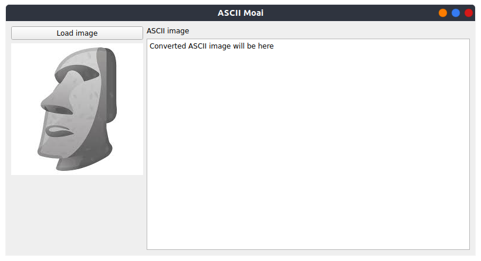

# Assignment 04

Group members
- FullName1 (StudentID) (Problem #)
- FullName2 (StudentID) (Problem #)
- FullName3 (StudentID) (Problem #)
- etc.


## Problem 1: Moai Converter: Read Moai image 
Menggunakan fungsi [`matplotlib.pyplot.imread()`](https://matplotlib.org/stable/api/_as_gen/matplotlib.pyplot.imread.html), 
bacalah berkas [`images.jpeg`](./images.jpeg) sehingga didapatkan `list` tiga dimensi
dengan ukuran 225 x 225 x 3. Angka 3 terahir di ukuran ini menyatakan _channel_
warna (_Red_, _Green_, _Blue_).

Namakan fungsi untuk mendapatkan _list_ tersebut dengan nama `read_image()`.

Bentuk fungsi yang akan dibuat:
```py
def read_image(filename):
  # Isi disini untuk jawaban
```


## Problem 2: Moai Converter: Get Moai image pixels 
Ambil salah satu _channel_ dari hasil Problem 1, misal channel _Red_, ubah
ke dalam skala nilai 0 dan 1 dengan cara membagi nilai di dalam list dengan 255.

Buat proses tranformasi skala nilai tersebut dalam fungsi berikut
```py
def image_to_ascii(filename):
  arr_moai = read_image(filename)
  arr_moai_red_channel = None  # Ganti `None` dengan jawaban
  
```


## Problem 3: Moai Converter: Transform pixels  
Diberikan _gradient characters_ yang digunakan untuk menyatakan ukuran 
kecerahan dari suatu gambar sebagai berikut:
```py
# karakter paling kiri paling cerah, karakter paling kanan paling gelap
char_bright_normal2 = " .:;x"
```

Diberikan juga rentang kecerahan[^1] untuk masing-masing _gradient characters_
sebagai berikut
- nilai pixel `0.0 <= px < 0.3` diganti dengan karakter `x` (huruf x)
- nilai pixel `0.3 <= px < 0.5` diganti dengan karakter `;` (titik koma)
- nilai pixel `0.5 <= px < 0.6` diganti dengan karakter `:` (titik dua)
- nilai pixel `0.6 <= px < 0.9` diganti dengan karakter `.` (titik)
- nilai pixel `0.9 <= px <= 1.0` diganti dengan karakter ` ` (spasi)


Rentang tersebut dapat dinyatakan dalam bentuk list, dan dapat dilakukan penggantian
nilai pixel pada `arr_moai_red_channel_scaled`
```py
char_bin = [0., 0.3, 0.5, 0.6, 0.9, 1.]
```


```py
def image_to_ascii(filename):
  arr_moai = read_image(filename)
  arr_moai_red_channel = None  # Ganti `None` dengan jawaban
  
  # Kode berikut digunakan agar proporsi gambar tetap terjaga, 
  # fungsi resize dapat diperoleh dari 
  # from skimage.transform import resize
  output_shape = (50, 100)
  arr_moai_red_channel_scaled = resize(arr_moai_red_channel, output_shape, 
                                        anti_aliasing=True)
  
  char_bright_normal2 = " .:;x"
  char_bin = [0., 0.3, 0.5, 0.6, 0.9, 1.]
  arr_moai_ascii = []
  # Tulis jawaban di bawah menggunakan arr_moai_red_channel_scaled sebagai input 
  # Lakukan looping untuk semua pixel dan diubah ke karakter ASCII yang sesuai


  return "\n".join(arr_moai_ascii)
```
Lengkapi fungsi diatas untuk mendapatkan hasil konversi gambar berupa karakter
ASCII.

## Problem 4: Moai Converter: Create baseline program
Pada bagian ini akan diberikan program dasar sebagai berikut dan beberapa
tata letak penulisan kode program dasar. Simpan file berikut dengan 
nama `converter.py`.

```py
# Taruh semua library yang perlu diimport disini

# Definisi fungsi
def read_image(filename):
  # isi program di problem sebelumnya


def image_to_ascii(filename):
  # isi program di problem sebelumnya


# Definisi class 
class MainWindow(QMainWindow):
  def __init__(self):
    super().__init__()

    # -- TAHAP 1
    self.setWindowTitle()  # Ganti nama program
    self.setMinimumSize()  # Ganti ukuran 

    # Isi dengan deklarasi button sesuai diagram (ganti ... dengan jawaban)
    button = ... 

    # Isi dengan deklarasi label dan alignment sesuai diagram (ganti ... dengan
    # jawaban)
    label = ...

    # Isi dengan deklarasi load_image dan ascii_image beserta alignment-nya 
    # sesuai diagram (ganti ...  dengan jawaban)
    self.load_image = ...
    self.ascii_image = ...

    # -- TAHAP 2
    # Isi dengan deklarasi menggunakan QVBoxLayout atau QHBoxLayout mengikuti
    # diagram yang diberikan  (ganti ... dengan jawaban)
    layout_vert_left = ... 
    layout_vert_right = ...
    layout_hort = ...


    # -- TAHAP 3
    # Isi dengan deklarasi widget dan pasangan ke MainWindow (self.) sesuai diagram
    widget = ... 
    

  def open_dialog_file(self):
    # akan diisi pada problem berikutnya
    return None

  def set_image(self):
    # akan diisi pada problem berikutnya
    return None

if __name__ == "__main__":
  app = QApplication([])

  window = MainWindow()
  window.show()

  app.exec()

```

Untuk tiga tahap diatas diberikan oleh gambar berikut (diklik untuk membuka
gambar):
- [TAHAP 1](./a-04-step-01.png)
- [TAHAP 2](./a-04-step-02.png)
- [TAHAP 3](./a-04-step-03.png) 

_Petunjuk_: gunakan perintah yang di-_highlight_ warna kuning. 
Kalian tidak perlu membuat kode baru, cukup menempatkan pada lokasi yang tepat 
untuk program dasar di atas. Tambahkan sedikit _layout hacking_: 
`layout_vert_left.addStretch()`  dan `layout_vert_right.addStretch()` setelah
widgets (QPushButton, QLabel, QLineEdit) ditambahkan pada dua layout tersebut,
agar tampilan memiliki _alignment_ yang sama. Jika ada solusi yang lebih baik
silahkan digunakan.

## Problem 5: Moai Converter: Create program without backend
Berikutnya kita akan menghubungkan tombol `button` dengan fungsi
`open_dialog()`. Buka diagram [TAHAP 4](./a-04-step-04.png) dan
ikuti pengisian deklarasi fungsi `open_dialog_file()`
dan `set_image()`. Pastikan kaliam memahami koneksi setiap 
pemanggilan fungsi dan variable yang ditandai dengan warna
_highlighted_ yang sama.

Jika langkah diikuti dengan tepat maka akan dihasilkan program seperti berikut:
<table>
  <tr>
    <td>
    <td>
</table>

## Problem 6: Moai Converter: Final program 
Hubungkan `image_to_ascii` dengan perintah berikut yang diletakkan
di dalam fungsi `set_image()`

```py
def set_image(self):
  # jawaban dari Problem sebelumnya

  # perintah baru yang ditambahkan
  self.ascii_image.setFont(QFont("Courier", 5, weight=QFont.Bold))
  self.ascii_image.setText(image_to_ascii(self.filename))
  self.ascii_image.setStyleSheet("background-color: white;")
```

Jelaskan ketiga perintah diatas dan kegunaannya dalam program.

Jika langkah diikuti dengan tepat maka akan dihasilkan program seperti berikut:
 

[Opsional]: Lakukan pengembangan design tampilan program menggunakan
[PyQt Material Design](https://github.com/zhiyiYo/QMaterialWidgets) jika
dirasa design masih bisa diperbaiki.


[^1]: Rentang kecerahan ini ditentukan dengan menggunakan histogram dan membagi
skala secara kualitatif. Teknik yang lebih maju dapat menggunakan _clustering_
warna yang dibahas lengkap dalam kuliah _machine learning_.