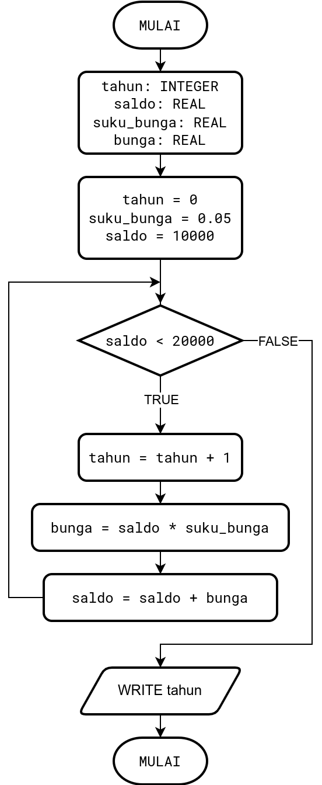

> Berikut adalah tempate soal menggunakan contoh soal
> dan jawaban dari _slide_ di pertemuan 5. 
> Silahkan format (bukan jawaban) mengikuti contoh 
> pengerjaaan soal berikut.
> Pada bagian akhir disertakan juga panduan pengetikan
> dan beberapa *links* yang sekiranya berguna
> untuk mengetik beberapa format penulisan.

# Template Assignment 01

**Anggota kelompok**
- Nama Mahasiswa 1 (NIM) (no soal yang dikerjakan bisa lebih dari satu)
- Nama Mahasiswa 2 (NIM) (1)
- Nama Mahasiswa 3 (NIM) (2, 4)
- dst.


## Soal 1

Diberikan suatu _pseudocode_ untuk menghitung bunga majemuk sebagai berikut

```
tahun: INTEGER
saldo: REAL
suku_bunga: REAL
bunga: REAL

tahun = 0
suku_bunga = 0.05
saldo = 10000
WHILE saldo < 20000 DO
  tahun = tahun + 1
  bunga = saldo + suku_bunga
  saldo = saldo + bunga
ENDWHILE
WRITE tahun
```
- Buatlah _flowchart_ untuk _pseudocode_ di atas
- Analisa perubahan nilai setiap variabel dengan menggunakan 
  tabel berikut (ganti ?? dengan nilai yang tepat dan tentukan jumlah
  baris berdasarkan saat program berhenti / perulangan berhenti)

  | `tahun` | `bunga` | `saldo` |
  |---------|---------|---------|
  | `0`     | -       | `10000` |
  | ??      | ??      | ??      |
  | ??      | ??      | ??      |
  | ??      | ??      | ??      |
  | `...`   | `...`   | `...`   |

- Pada tahun berapa saldo mencapai lebih dari 20000? 
  Berapa nilai saldo pada tahun tersebut?
  
### Jawaban

Berikut adalah _flowchart_ untuk program di atas. Ilustrasi digambar
menggunakan drawio. Bisa juga menggunakan gambar tangan lalu di foto
lalu disisipkan pada _markdown_.



Sedangkan untuk analisa perubhan nilai setiap variabel diberikan sebagai 
berikut

  | `tahun` | `bunga`  | `saldo`    |
  |---------|----------|------------|
  | `0`     | -        | `10000`    |
  | `1`     | `500`    | `10500`    |
  | `2`     | `525`    | `11025`    |
  | `3`     | `551.25` | `11576.25` | 
  | `4`     | `578.81` | `12155.06` |
  | `5`     | `607.75` | `12762.82` |
  | `6`     | `638.14` | `13400.96` |
  | `7`     | `670.05` | `14071.00` |
  | `8`     | `703.55` | `14774.55` |
  | `9`     | `738.74` | `15512.28` |
  | `10`    | `775.66` | `16288.95` |
  | `11`    | `814.45` | `17103.39` |
  | `12`    | `855.17` | `17958.56` |
  | `13`    | `897.93` | `18856.49` |
  | `14`    | `942.82` | `19799.32` |
  | `15`    | `989.97` | `20789.28` |
  
Pada tabel di atas terlihat perulangan `WHILE ... DO` akan berhenti
setelah `tahun = 15` karena pada saat itu `saldo = 20789.28` yang 
lebih besar dari `20000` sehingga mengakibatkan kondisi di `WHILE ... DO`
yaitu `saldo < 20000` akan bernilai `FALSE` (perulangan berhenti).


## Beberapa contoh _styling_ dan format di Markdown
Berikut hanyalah sebagian kecil contoh. Untuk lebih lengkap
silahkan mengakses [Markdown Guide](https://www.markdownguide.org/)

Contoh **huruf tebal**

Contoh _huruf miring_


Contoh daftar dengan nomor 
1. item 1
   1. item 1.1
   2. item 1.2
      1. item 1.2.1
2. item 2
3. item 3

Contoh daftar tanpa nomor 
- item 1 
  - item 1.1
  - item 1.2
    - item 1.2.3
- item 2 (setelah kalimat ini terdapat beberapa spasi
  agar Paragraf item 2 berada di baris baru dan sejajar 
  item 2)    
  Paragraf item 2
- item 3
  - item 3.1


Contoh penyisipan gambar menggunakan perintah bawaan 
Markdown


Contoh penyisipan gamabr menggunakan perintah HTML ``


Contoh tabel
|$p$ | $q$ | $p \wedge r$  |
|----|-----|---------------|
|T | T | T  | 
|T | F | F  | 
|F | T | F  | 
|F | F | F  | 


Contoh baris kode dengan warna
```py
angka = 1
for i in range(1, 101):
  print(angka)
  angka = angka = 1
```

Persamaan dan simbol matematika diketika menggunakan
perintah TeX, lebih lengkap dapat dilihat di 
[MathJax basic tutorial and quick reference](https://math.meta.stackexchange.com/questions/5020/mathjax-basic-tutorial-and-quick-reference).    

Gunakan [detexify](https://detexify.kirelabs.org/classify.html) untuk mencari secara cepat perintah TeX 
