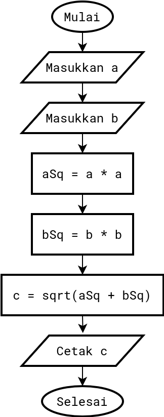

# Pertemuan Minggu 02

**Tujuan**:
Mahasiswa mampu menggunakan algoritma, diagram alir,
dan _pseudocode_ I/O, yang melibatkan variabel, ekspresi,
dan mengimplementasikannya dengan Python melalui
IDE PyCharm Edu.

### Sub-topik yang akan dipelajari
- [_Pseudocode_](#21-pseudocode)
- [Diagram alir](#22-diagram-alir)

Untuk kelas L yang diampu oleh saya, mahasiswa dipersilahkan
untuk mengunakan VSCode sekalipun dalam praktikum menggunakan
PyCharm. Alasan saya menyarankan menggunakan VSCode dikarenakan
program yang _lightweight_ (ringan dijalankan) dibanding
PyCharm. Jika spesifikasi komputer cukup untuk menjalankan
PyCharm, silahkan menggunakan PyCharm.


## [2.1 Pseudocode](#sub-topik-yang-akan-dipelajari)

- Kode atau tanda yang menyerupai (_pseudo_) program atau 
  merupakan penjelasan cara menyelesaikan suatu masalah
- _Pseudo code_ sering digunakan oleh manusia untuk menuliskan 
  algoritma
- _Pseudo code_ ditulis menggunakan bahasa manusia 
  (bahasa Inggris, Indonesia, atau bahasa komunikasi lainnya).

### Contoh

**Masalah**: Mencari bilangan terbesar dari dua bilangan yang dimasukkan

**Solusi** (berupa algoritma): 
- Masukkan bilangan pertama
- Masukkan bilangan kedua
- Jika bilangan pertama lebih besar daripada bilangan kedua maka bilangan
  pertama adalah bilangan terbesar, jika tidak, bilangan kedua
  adalah bilangan terbesar
- Tampilkan bilangan terbesar

**Solusi** (berupa _pseudocode_)
- Input `a`
- Input `b`
- If `a > b` then `terbesar = a`, else `terbesar = b`
- Print `terbesar`

### Perbandingan algoritma dan _pseudocode_

<table width="300">
  <tr>
    <td> <b>Algoritma</b> 
    <td> <b><i>Pseudocode</i></b> 
  <tr>
    <td> <code>A</code> adalah nilai <code>A</code> lama ditambah dengan 5
    <td> <code>A <- A + 5 </code>
  <tr>
    <td> Cetak nilai <code>A</code> bila lebih besar dari 10
    <td> <code>IF A > 10</code><br>
         <code>  THEN PRINT A</code>
  <tr>
    <td> Dari dua bilangan <code>A</code> dan <code>B</code>,
         cetak bilangan terbesar
    <td> <code>IF A > B</code><br>
         <code>  THEN PRINT A</code><br>
         <code>ELSE</code><br>
         <code>  PRINT B</code>
</table>

### Sintaksis _pseudocode_

- Menerima input: **READ**, **GET**
- Menampilkan output: **DISPLAY**, **PRINT**, **WRITE**, **SHOW**
- Aritmatika: `+`, `-`, `*`, `/`, `%`, `div`, `sub`, `mul`, `add`
- Pemberian nilai (_assignment_); **SET** `nama_variable <- nilai`
- Inisialisasi: **INIT**, **SET**
- Pemilihan: **IF ... THEN ... ELSE ...**, **CASE**
- Perulangan: **FOR**, **WHILE**

### Contoh 1: _Pseudocode_ dengan percabangan

```
READ x
READ y
READ z
IF (x = y) 
  PRINT x
ELSE
  IF (y < z)
    PRINT y
  ELSE
    PRINT z
```

Jika input `x = 15`, `y = 20`, dan `z = 5`, maka outputnya adalah 
`PRINT z`

### _Pseudocode_ dengan perulangan

```
SET count <- 1
WHILE (count < 6)
  PRINT count
  count <- count + 1
ENDWHILE
```

Output dari _pseudocode_ di atas adalah program akan mencetak bilangan
1 sampai 5.
Baris `count <- count + 1` akan dieksekusi sebanyak 5 kali.


### Contoh 3: Konversi suhu

Berikut adalah _pseudocode_ konversi suhu dari satuan Celcius ke
Reamur dan Fahrenheit

```
INPUT celcius
SET reamur <- (4.0/5.0) * celcius
SET fahrenheit <- (9.0/5.0) * celcius + 32.0
PRINT reamur
PRINT fahrenheit
```

## [2.2 Diagram alir](#sub-topik-yang-akan-dipelajari)

Diagram alir adalah bentuk gambar/diagram yang mempunyai aliran satu atau 
dua arah secara berurutan (_sequential_).

Kegunaan diagram alir adalah untuk 
- merancang program
- merepresentasikan program 

Berdasarkan kegunaan kedua, untuk itulah suatu _flowchart_ harus mampu
merepresentasikan komponen-komponen suatu bahasa pemrograman.

### Tujuan Pembuatan Flowchart
- [Sebelum pembuatan program]: berguna untuk mempermudah _programmer_
  dalam menentukan alur logika program

- [Sesudah pembuatan program]: berguna untuk menjelaskan alur program
  kepada orang lain

### Simbol/Lambang 
- Mulai/selesai (_terminator_)
- Aliran data
- _Input_/_Output_
- Proses
- Percabangan (_Decision_)
- Pemberian nilai awal suatu variable (_Preparation_)
- Pemanggilan prosedur/fungsi (_Call_)
- _Connector_ (di halaman yang sama)
- _Off page Connector_ (halaman lain)
- _Sequence Process_
- Perulangan

### Contoh 1: Algoritma dan _flowchart_ untuk mencari sisi miring suatu segitiga siku-siku

**Algoritma**:
- Masukkan nilai `a` dan `b` yang merupakan sisi pembentuk sudut siku-siku
- Hitung `aSq = a * a`
- Hitung `bSq = b * b`
- Hitung `c = sqrt(a^2 + b^2)` (rumus Pythagoras)

**_Flowchart_**    
