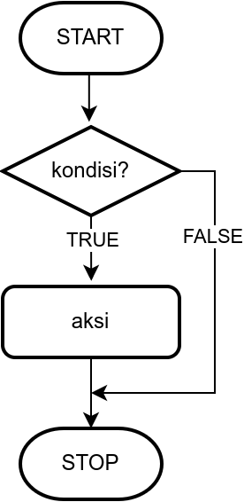
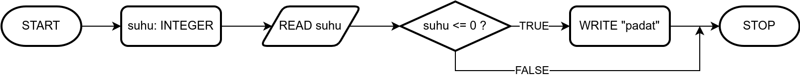
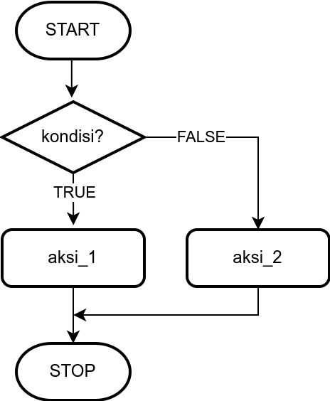
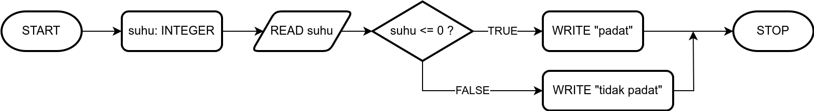
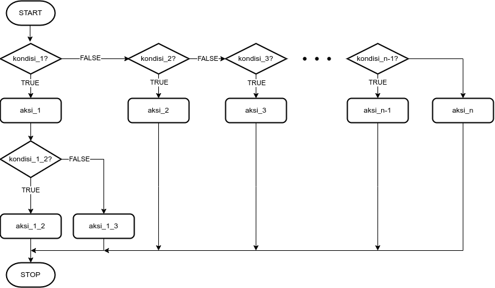
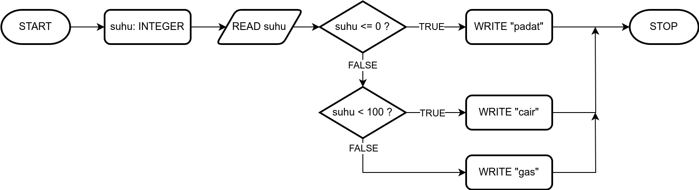

# Pertemuan Minggu 03

**Tujuan**: Mahasiswa mampu membuat algoritma, diagram alir, 
dan _pseudocode_ eksekusi kondisional dan mengimplementasikannya dengan Python.

### Subtopik yang akan dipelajari
- [Pemilihan, _Selection_](#31-pemilihan)
- [Struktur pemilihan satu kondisi (`if`)](#32-pemilihan-satu-kondisi)
- Struktur pemilihan satu kondisi dengan aksi ketika salah (`if else`)
- Struktur pemilihan lebih dari satu kondisi
- Operator logika
- Operator relasi
- Beberapa contoh program dengan pemilihan


## [3.1 Pemilihan](#subtopik-yang-akan-dipelajari)

**Pemilihan** yaitu instruksi yang dikerjakan dengan kondisi tertentu

**Kondisi** adalah persyaratan yang dapat bernilai benar atau salah.

Ketika program dihadapkan dengan dua pilihan, yaitu kondisi bernilai benar
atau salah, maka setiap cabang (cabang benar atau cabang salah)
memiliki beberapa instruksi (satu atau lebih). Kita tidak bisa menjalankan
dua cabang sekaligus.


### Struktur pemilihan 
Di dalam struktur pemilihan ada tiga jenis:
1. Pemilihan satu kondisi, menggunakan `if else`
2. Pemilihan untuk satu kondisi dengan aksi ketika salah, menggunakan `if else`
3. Pemilihan unutk lebih dari satu kondisi, menggunakan `if else` bertingkat


## [3.2 Pemilihan satu kondisi](#subtopik-yang-akan-dipelajari)

### _Pseudocode_ untuk pemilihan satu kondisi

Bentuk umum (_pseudocode_) untuk pemilihan satu kondisi
```
IF kondisi THEN 
  aksi
```

Beberapa penjelasan pemilihan satu kondisi
- Pada pemilihan satu kasus, jika kondisi bernilai **SALAH** (**FALSE**)
  maka `aksi` tidak dijalankan
- Aksi dapat terdiri dari sejumlah instruksi yang berupa proses, input, atau output
- Jika aksi selesai dikerjakan, lanjutkan ke proses berikutnya


### _Flowchart_ untuk pemilihan satu kondisi




### Contoh 

Berikut adalah contoh _pseudocode_ untuk menentukan suatu objek padat
atau tidak berdasarkan suhunya

1. Masukkan nilai suhu berupa bilangan bulat
2. Jika suhu bernilai kurang dari atau sama dengan 0, maka tuliskan
   bahwa objek berupa zat "padat"
3. Jika tidak, lanjutkan ke instruksi berikutnya

```
suhu: INTEGER   # ditentukan jenis variabel (bilangan bulat)
READ suhu
IF (suhu <= 0) THEN
  WRITE "padat"
```

Berikut _flowchart_ untuk _pseudocode_ di atas



## 3.2 Pemilihan untuk satu kondisi dengan aksi ketika salah

### _Pseudocode_ 

Bentuk umum (_pseudocode_) pemilihan untuk satu kondisi dengan aksi ketika salah
```
IF kondisi THEN 
  aksi_1
ELSE
  aksi_2
```

Pada struktur pemilihan ini, jika kondisi **BENAR** (**TRUE**), maka
kerjakan `aksi_1`, Jika kondisi **SALAH** (**FALSE**) kerjakan `aksi_2`

### _Flowchart_ 




### Contoh 

Berikut adalah contoh _pseudocode_ untuk menentukan suatu objek padat
atau "tidak padat" berdasarkan suhunya

1. Masukkan nilai suhu berupa bilangan bulat
2. Jika suhu bernilai kurang dari atau sama dengan 0, maka tuliskan
   bahwa objek berupa zat "padat"
3. Jika tidak, maka tuliskan bahwa objek berupa zat "tidak dapat" 


```
suhu: INTEGER   # ditentukan jenis variabel (bilangan bulat)
READ suhu
IF (suhu <= 0) THEN
  WRITE "padat"
ELSE
  WRITE "tidak padat"
```

Berikut _flowchart_ untuk _pseudocode_ di atas




## 3.4 Pemilihan untuk lebih dari satu kondisi

Berikut adalah _pseudocode_ pemilihan untuk lebih dari satu kondisi
(`if else` bertingkat)

```
IF kondisi_1 THEN
  aksi_1
  IF kondisi_1_2 THEN
    aksi_1_2
  ELSE
    aksi_1_3
ELSE
  IF kondisi_2 THEN
    aksi_2
  ELSE
    IF kondisi_3 THEN
      aksi_3
    ELSE
    .
    .
    .
      IF kondisi_n-1 THEN
        aksi_n-1
      ELSE
        aksi_n
```

### _Flowchart_



### Contoh

Penentuan suatu objek apakah berbentuk padat, cair, 
atau gas

1. Masukkan nilai suhu berupa bilangan bulat
2. Jika suhu bernilai kurang dari atau sama dengan 0, maka tuliskan
   bahwa objek berupa zat "padat"
3. Jika suhu bernilai lebih besar dari 0 dan kurang dari 100, maka tuliskan
   bahwa objek berupa zat "cair"
4. Jika suhu bernilai lebih besar dari 100, maka tuliskan bahwa objek berupa
   zat "gas"

Lalu _pseudocode_ untuk algoritma di atas

```
suhu: INTEGER   # ditentukan jenis variabel (bilangan bulat)
READ suhu
IF (suhu <= 0) THEN
  WRITE "padat"
ELSE
  IF (suhu < 100) THEN
    WRITE "cair"
  ELSE
    WRITE "gas"
```

### _Flowchart_



