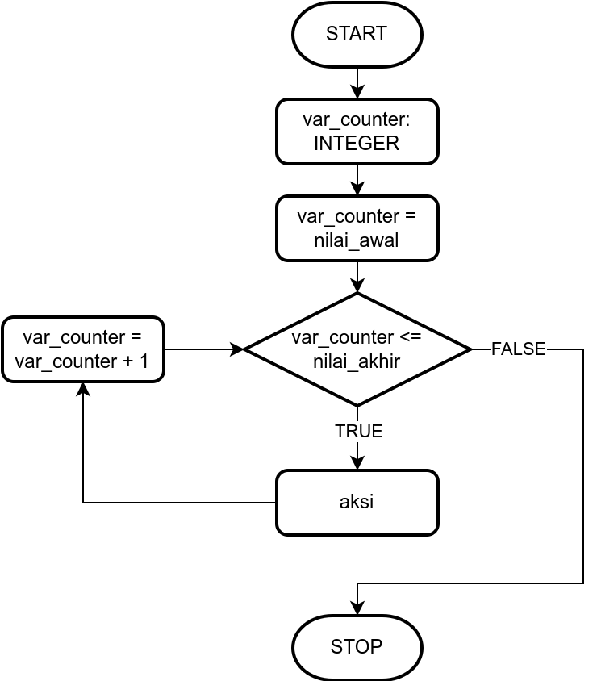
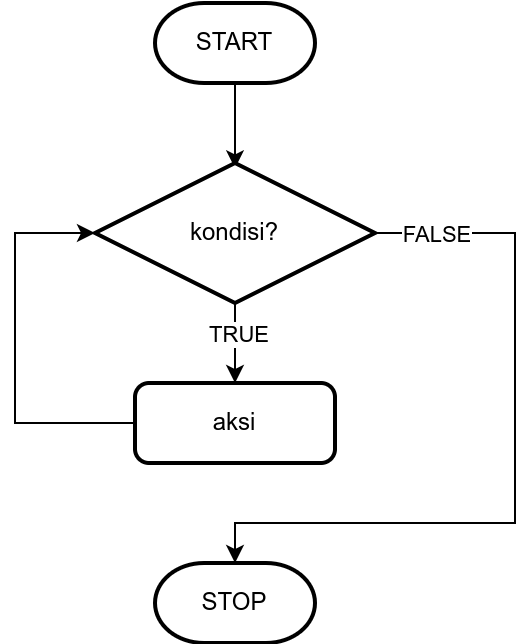
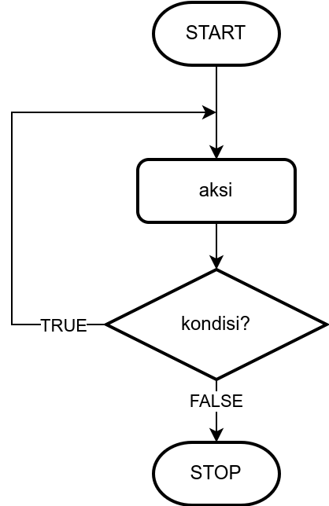
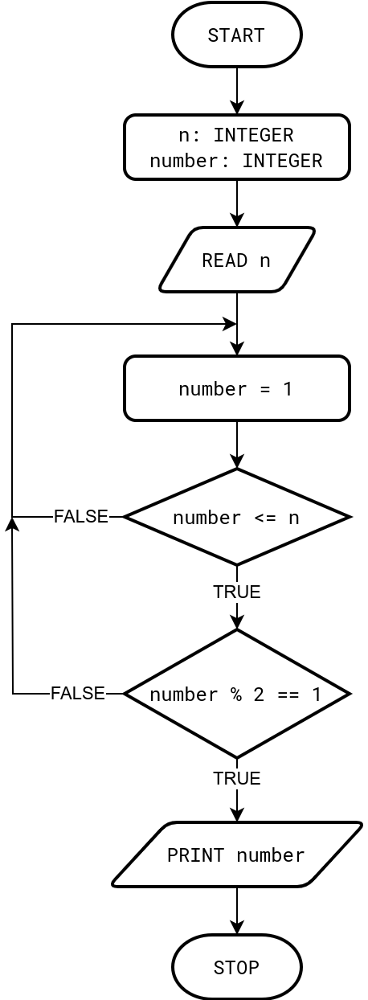

# Pertemuan Minggu 04 dan 05

**Tujuan**: Mahasiswa mampu membuat algoritma, diagram alir, dan
_pseudocode_ perulangan dan mengimplementasikannya dengan Python

### Subtopik yang akan dipelajari
- Algoritma perulangan
- Diagram alir perulangan dengan percabangan
- _Pseudocode_ `WHILE`
- Kode program Python dengan `WHILE`

## 4.1 Perulangan

**Perulangan** adalah struktur algoritma yang memungkinkan adanya
_statement_ atau aksi yang dijalankan berkali-kali sampai kondisi
perulangannya terpenuhi.

Struktur perulangan merupakan cara yang efektif untuk melakukan suatu
proses yang memiliki pola yang sama dengan baris algoritma yang lebih
singkat.

**Contoh permasalahan**

Berikut diberikan _pseudocode_ untuk mencetak angka 1 sampai 100

```
angka: INTEGER
angka = 1
WRITE angka

angka = 2
WRITE angka

angka = 3
WRITE angka

...

angka = 100
WRITE angka
```

Berikut adalah implementasi Python untuk _pseudocode_ di atas

```py
angka = 1
print(angka)

angka = 2
print(angka)

angka = 3
print(angka)

# ... diketik sampai 99

angka = 100
print(angka)
```

Untuk mengatasi pengetikan yang berulang-ulang, dapat digunakan
perulangan sehingga program lebih ringkas.

Berikut adalah _pseudocode_ untuk perulangan dengan masalah
seperti di atas, yaitu mencetak angka 1 sampai 100

```
angka: INTEGER
FOR angka = 1 TO 100 DO
  WRITE angka
ENDFOR
```

- proses di atas akan mencetak angka `1` `2` `3` ... `100`
- variabel yang digunakan untuk mencacah adalah `angka`
- baris ke-2 hingga ke-4 akan dijalankan (dieksekusi) hingga nilai
  `angka` mencapai `100` 


Sedangkan implementasi _pseudocode_ untuk program di atas dalam
bahasa Python adalah sebagai berikut:
```py
for angka in range(1, 101):
  print(angka)
```

**Berbagai macam struktur perulangan**
Berikut adalah tiga macam struktur perulangan yang sering
digunakan dalam pembuatan program atau penyusunan algoritma
- Perulangan `FOR`
  ```
  FOR iterator DO
    aksi
  ENDFOR
  ```

- Perulangan `WHILE`
  ```
  WHILE kondisi DO
    aksi
  ENDWHILE
  ```

- Perulangan `DO WHILE`
  ```
  DO 
    aksi
  WHILE kondisi
  ```


## 4.2 Perulangan `FOR`


**_Pseudocode_**
```
FOR iterator DO

ENDFOR
```

**_Flowchart_**



Implementasi Python
```py
for variabel_indeks in range(start, stop):
  # aksi_1
```

## 4.3 Perulangan `WHILE`

- Perulangan `WHILE` digunakan untuk melakukan pengulangan selama
  kondisi pengulangannya bernilai `TRUE`.
- Apabila kondis perulangan sudah bernilai `FALSE` maka perulangan berhenti
- `WHILE` melakukan pemeriksaan kondisi di awal perulangan

Berikut adalah _pseudocode_ untuk `WHILE`
```
WHILE kondisi DO
  aksi
ENDWHILE
```

- Jika diperhatikan, format `WHILE` dan format `IF` memiliki kemiripan.
- Namun `WHILE` akan melakukan `aksi` berulang-ulang selama `kondisi` bernilai
  <span style="color:green">`TRUE`</span> 
  dan selesai jika `kondisi` bernilai 
  <span style="color:red">`FALSE`</span>.
- Sedangkan `IF` hanya akan mengerjakan sekali jika `kondisi`
  <span style="color:green">`TRUE`</span> atau tidak dikerjakan jika 
  <span style="color:red">`FALSE`</span>.
- Diperlukan suatu `aksi` yang membuat kondis 
  <span style="color:red">`FALSE`</span>, agar perulangan selesai dan
  tidak terjadi _infinite loop_ (perulangan tak hingga)

**_Flowchart_**




Implementasi Python
```py
while kondisi:
  aksi
```

### Example
Penerapan `WHILE` untuk mencetak bilanga 1 sampai 100

**_pseudocode_**
```py
angka: INTEGER
angka = 1
WHILE angka <= 100 DO
  WRITE angka
  angka = angka + 1
ENDWHILE
```

Implementasi Python
```py
angka = 1
while (angka < 101):
  print(angka)
  angka = angka + 1
```

## 4.4 Perulangan `DO ... WHILE`
- Struktur perulangan `DO ... WHILE` akan mengerjakan `aksi` satu kali 
  terlebih dahulu, kemudian `kondisi` diuji.
- Seandainya `kondisi` bernilai `TRUE`, maka `aksi` akan dikerjakan lagi,
  kemudian `kondisi` diuji kembali, dan seterusnya
- Jika `kondisi` bernilai `FALSE`, maka perulangan selesai

**_pseudocode_**
  ``` 
  DO 
    aksi
  WHILE kondisi
  ``` 

- `aksi` dikerjakan _setidaknya satu kali_, berbeda dengan while yang 
  tidak mengerjakan `aksi` sama sekali jika `kondisi` bernilai
  <span style="color:red">`FALSE`</span> dari awal.
- Diperlukan suatu `aksi` yang membuat `kondisi`
  <span style="color:red">`FALSE`</span>, agar perulanga selesai 
  dan tidak terjadi _infinite loop_ (perulangan tak hingga)
- Contoh penerapan umum konsep `DO ... WHILE` adalah dialog
  _exit for system (yes/no)_.

**_flowchart_**



Berikut adalah implementasi Python. Karena Python tidak memiliki 
sintaks `DO ... WHILE` secara bawaan (_built-in syntax_), maka kita
menggunaka `while` dengan kondisi _infinite loop_ dan di dalam 
`aksi` kita tambahkan _kondisi_ untuk berhenti menggunakan sintaks `break`
```py
while True:
  aksi
  if kondisi:
    break
```

## Kasus saat digunakan `FOR`, `WHILE`, atau `DO ... WHILE`
- `FOR`: digunakan saat **diketahui berapa kali** suatu perulangan akan 
  dieksekusi
- `WHILE`: digunakan saat jumlah perulangan **tidak diketahui**
- `DO WHILE`: digunakan saat jumlah perulangan **tidak diketahui**
  namun perulangan setidaknya harus dikerjakan **satu kali**

## Ringkasan

<table>
  <tr>
    <td> <b>Kriteria</b>
    <td> <code>FOR</code>
    <td> <code>WHILE</code>
    <td> <code>DO ... WHILE</code>
  </tr>
  <tr>
    <td> Jumlah perulangan diketahui 
    <td> Ya
    <td> Tidak
    <td> Tidak
  </tr>
  <tr>
    <td> Pengecekan kondisi
    <td> Ya
    <td> Ya, di awal
    <td> Ya, di akhir
  </tr>
  <tr>
    <td> Jumlah perulangan minimum
    <td> Sesuai jumlah perulangan
    <td> 0
    <td> 1
  </tr>
</table>

## Contoh (Latihan 1) 
Buat _pseudocode_ dan _flowchart_ untuk menampilkan
bilangan ganji positif sebanyak `n` bilangan

**_pseudocode_**
```
n: INTEGER
number: INTEGER
READ n
FOR number = 1 TO n DO
  IF (number % 2 == 1)
    PRINT number
ENDFOR
```

**_flowchart_**



##
The student who wrote a program using `DO ... WHILE` in Python: 
Bagus (11231015)