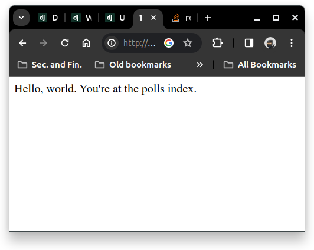

Before you do anything below, enter the selected pre-created conda environement
by typing
```
conda activate <your_environment_name>
```

1. PostgreSQL installation, using psycopg3
   ```
   pip install "psycopg[binary]"
   ```

2. Install Django
   ```
   pip install Django 
   ```

3. Verifying
   ```py
   import django
   print(django.get_version())
   ```

## Writing your first Django app, part 1

We will create a basic poll application.
This site consists of two parts:
- A public site that lets people view pools and vote in them.
- An admin site that lets you add, change, and delete polls.

### Create a project directory
Create a directory where you store all your codes
```
./poll-site-project/
```

Enter that directory using `cd`, and type
```sh
django-admin startproject mysite
```
This will create `mysite` directory inside `./poll-site-project/` directory with the following 
structure
```
poll-site-project/
└─ mysite/
   ├─ mysite/
   │  ├─ __init__.py
   │  ├─ settings.py
   │  ├─ urls.py
   │  ├─ asgi.py
   │  └─ wsgi.py
   └─ manage.py
```


### Start server

Inside `./poll-site-project/`, start the development server
```sh
python manage.py runserver
```

Automatic reloading of `runserver`   
It might be possible when adding a new file, you have to restart the server.

### Create the Polls app

Inside `./poll-site-project/`, (the same directory
with `manage.py`), create the Polls app by entering
this command
```sh
python manage.py startapp polls
```
This will create the following directory structure
```
poll-site-project/
└─ mysite/
   ├─ mysite/
   ├─ polls/
   │  ├─ __init__.py
   │  ├─ admin.py
   │  ├─ apps.py
   │  ├─ migrations/
   │  │  └─ __init__.py
   │  ├─ models.py
   │  ├─ tests.py
   │  └─ views.py
   └─ manage.py
```

### Write your first view
This will be your "Hello World!" for Django app.

Open file `polls/views.py`, and put the following code

**`polls/view.py`**
```py
from django.http import HttpResponse

def index(request):
  return HttpResponse("Hello, world. You're at the polls index.)
```

To call this view (`polls/view.py`), we need to map
it to a URL - as for this we need a URLconf (see
[URL dispatcher](https://docs.djangoproject.com/en/4.2/topics/http/urls/) for the complete explanation).

Create a file `urls.py` inside `polls` directory.
This file will serve as URLconf for `polls` app.
Add the following code to that file.

**`polls/urls.py`**
```py
from django.urls import path

from . import views

urlpatterns = [
  path("", views.index, name="index"),
]
```
This will set a URLconf in app level.

If we run our program at this moment, it won't show
anything. This is because we have not set the
URLconf in our project level. In `mysite/urls.py`, 
insert the following command

**`mysite/urls.py`**
```py
from django.contrib import admin
from django.urls import include, path

urlpatterns = [
  path("polls/", include("polls.urls")),
  path("admin/", admin.site.urls),
]
```

Run again the server with the following command
where the terminal is inside the director `poll-site-project`
```sh
python manage.py runserver
```

You can access the `polls/view.py` using browser
with the following address
```
http://127.0.0.1:8000/polls
```

If you want to access `polls/view.py` without suffix
`polls` in the above addres, add the 
`path("", include="polls.urls")` in `urlpatterns`
of `mysite/urls.py`.

We will have the following result




## Writing your first Django app, part 2

### Creating models

A model is a database layout with additional metadata

In our poll app, we'll create two models:
- **Questions**    
  it has a question and a publication date
- **Choice**   
  it has two fields: the text of choice and a vote tally.

Each **Choice** is associated with a **Question**

Let us create these two models into our Polls app

**`polls/models.py`**
```py
from django.db import models

class Question(models.Model):
  question_text = models.CharField(max_length=200)
  pub_date = models.DateTimeField("date published")


class Choice(models.Model):
  question = models.ForeignKey(Question, on_delete=models.CASCADE)
  choice_text = models.CharField(max_length=200)
  votes = models.IntegerField(default=0)
```

The complete list of `models` attributes is 
listed in the documentation of [Field Types](
https://docs.djangoproject.com/en/4.2/ref/models/fields/#field-types)

Note to the `ForeignKey` attribute, we have
`on_delete=models.CASCADE`. This behaviour of deletion
is the same as the SQL command [`ON DELETE CASCADE`](https://www.sqlite.org/foreignkeys.html).
This is the case when you want to delete rows in 
the child table (**Choice**) when the corresponding
rows are deleted in the parent table (**Question**)


### Activating models

We need to tell our project the the **polls** app 
is installed

In `mysite/mysettings.py`.
Set into the following setting
```py
INSTALLED_APPS = [
  "polls.apps.PollsConfig",   # we only add this element
  "django.contrib.admin",
  "django.contrib.auth",
  "django.contrib.contenttypes",
  "django.contrib.sessions",
  "django.contrib.messages",
  "django.contrib.staticfiles",
]
```

Every time you update your model, you have to 
run the following procedure. [Fortunately, I have
tried to change the `polls/models.py` and it updates
automatically the database schema]

- This will update how your model store the database
  schema
  ```sh
  # Choose one from these options
  python manage.py makemigrations polls # manual
  python manage.py makemigrations       # all changes
  ```

- [Optional] To see the database schema that is automatically
  created for you by Python
  ```sh
  python manage.py sqlmigrate polls 0001
  ```
- Apply all changes into the database
  ```sh
  python manage.py migrate
  ```

### Adding data to the database

There are two ways to add the data to your database
- Django database API
- Django Admin  
  user: admin   
  password: t.st12345

See the complete tutorial in the 
[documentation](https://docs.djangoproject.com/en/4.2/intro/tutorial02/#playing-with-the-api)


## Writing your first Django app, part 3


