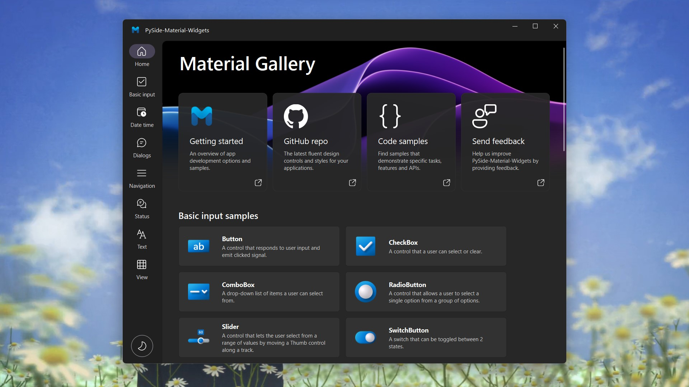

<p align="center">
  
</p>
  <h1 align="center">
  PyQt-Material-Widgets
</h1>
<p align="center">
  基于 PyQt5 的 Material Design 风格组件库
</p>

<p align="center">
  <a href="https://pypi.org/project/PyQt-Material-Widgets" target="_blank">
    
  </a>

  <a style="text-decoration:none">
    
  </a>

  <a style="text-decoration:none">
    
  </a>

  <a style="text-decoration:none">
    
  </a>
</p>

<p align="center">
<a href="../README.md">English</a> | 简体中文
</p>



## 安装📥
使用 pip 安装：
```shell
pip install PyQt-Material-Widgets -i https://pypi.org/simple/
```

> **Warning**
> 请勿同时安装 PyQt-Material-Widgets, PyQt6-Material-Widgets, PySide2-Material-Widgets 和 PyQt-Material-Widgets，因为他们的包名都是 `qmaterialwidgets`


## 运行示例▶️
使用 pip 安装好 PyQt-Material-Widgets 包并下载好此仓库的代码之后，可以运行 examples 目录下的示例程序，比如：
```python
cd examples/gallery
python demo.py
```


## 在线文档📕
想要了解 PyQt-Material-Widgets 的正确使用姿势？请仔细阅读 [帮助文档](https://qmaterialwidgets.vercel.app/zh/) 👈

## 支持💖
如果这个组件库帮助了您，或者是想支持作者继续开发和维护这个组件库，可以在 [爱发电](https://afdian.net/a/zhiyiYo) 或者 [ko-fi](https://ko-fi.com/zhiyiYo) 上请作者喝一杯奶茶。您的支持就是作者开发和维护的动力 🥰。

## 演示视频📽️
请查收哔哩哔哩上的 [视频合集](https://www.bilibili.com/video/BV1k14y1z74o)，它展示了 PyQt-Material-Widgets 的全部组件和特性 🎉

## 搭配 QtDesigner🚀
运行 `python ./tools/designer.py` 启动安装了 PyQt-Material-Widgets 插件的 QtDesigner。如果操作成功，QtDesigner 的侧边栏中将会显示 PyQt-Material-Widgets 的组件。对于旧项目的改造，推荐使用 [视频教程](https://www.bilibili.com/video/BV1na4y1V7jH) 中介绍的 `提升为...`。


## 参考
* [**Figma/Material 3 Design Kit**: Provides an introduction to the material design system](https://www.figma.com/community/file/1035203688168086460/Material-3-Design-Kit)
* [**Google/Material Design**: A website demonstrates the controls available in Material Design 3 System](https://m3.material.io/get-started)

## 许可证
PyQt-Material-Widgets 使用 [GPLv3](../LICENSE) 许可证进行授权。

Copyright © 2023 by zhiyiYo.
